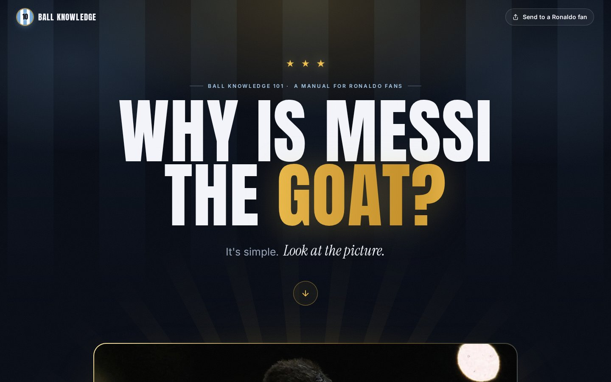

# Common Knowledge

Well, as you can see, this is a manual for all the Ronaldo fans that still haven't grasped the concept of why Messi is the GOAT. It's simple. Look at the picture: the World Cup.

**Live site:** https://smash09x.github.io/ball_knowledge/

## Preview



## What's on the page

- **Exhibit A:** the picture. Case closed (there's a stamp and everything).
- **The trophy cabinet:** for anyone who is somehow still not convinced.
- **Objections:** every argument a Ronaldo fan has ever made, answered in full detail.
- **A share button:** for sending it straight to a Ronaldo fan.
- Confetti. Obviously.

## Run it locally

It's a plain static site, with no build step. Open `index.html` in a browser, or run a tiny server from this folder:

```sh
python3 -m http.server
```

then visit http://localhost:8000.

## Files

| File | What it is |
| --- | --- |
| `index.html` | The page |
| `style.css` | All the styling (colours are at the top, easy to tweak) |
| `script.js` | Confetti, the stamp, count-up numbers, tickers and the share button |
| `Messi_World_Cup.webp` | The picture |
| `assets/` | README preview and the image shown when the link is shared |

Made By: Deez Nuts
